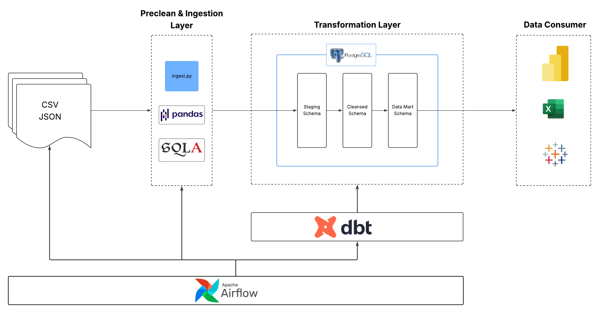

# Project Design: Automated Marketing Data Pipeline

## 1. Executive Summary
This project implements an automatic, end-to-end data pipeline orchestrated by **Apache Airflow**. It is designed to transform fragmented marketing data into centralized, actionable insights. The pipeline ingests multi-source raw data (CSV/JSON) into **PostgreSQL** via a robust Python-based ingestion layer (`ingest.py`). The transformation layer is managed by **dbt**, ensuring modularity, version control, and high data quality.

<p align="center">
  
</p>


---

## 2. Architecture Decision Records (ADR)

| Component | Choice | Rationale | Trade-offs |
| :--- | :--- | :--- | :--- |
| **Infrastructure** | **Docker** | Eliminates "it works on my machine" issues; ensures idempotency and portability. | Slight overhead in image management. |
| **Orchestration** | **Airflow 2.x** | Provides complex DAG dependency management and high observability via Web UI. | Requires more resources than simple Cron jobs. |
| **Ingestion** | **Python (ELT)** | Pandas/SQLAlchemy handles mixed date formats and non-standard strings more flexibly than pure SQL. | `to_sql` is less efficient for massive datasets (GB+) compared to bulk loading. |
| **Storage**| **PostgreSQL** | A rock-solid, reliable database and dbt friendly. | Reaches limits when data scales to petabytes. |
| **Transformation**| **dbt** | Supports modular SQL, automated documentation, and built-in testing. | Not ideal for non-SQL complex procedural logic. |

---

## 3. Data Handling & Business Logic (dbt Layer)

<p align="center">
  
</p>

### CRM Revenue Transformation
* **Deduplication**: Implemented `DISTINCT` on `order_id` to prevent revenue inflation.
* **Data Flagging**: Instead of dropping rows, we tag missing `order_id` and revenue outliers. This preserves auditability while allowing analysts to filter "junk" data from ROI calculations.

### Ad Platform Standardization
* **Unit Conversion**: Converted Google Ads `cost_micros` to standard currency (divided by $1,000,000$) to match Facebook Spend metrics.
* **Schema Alignment**: Populated missing dimensions (e.g., Reach on Google, Campaign Type on Facebook) with `'unknown'`. This enables a safe `UNION ALL` for the `marketing_master_view`.
* **Aggregation**: Additive metrics use `SUM()`, while frequency is calculated as:
    ```sql
    
    SUM(impression) / SUM(reach)  -- avg_frequency


### Attribution Lag Management
* **Rolling Window**: Implemented a **7-day rolling view** to account for the time gap between ad spend and CRM conversion, preventing skewed daily ROI spikes.

---

## 4. Data Quality Strategy
We employ a multi-layered defense to ensure "Single Source of Truth":

1.  **Ingestion Pre-cleaning**:
    * **Structural Repair (Column Overflow)**: Handles raw CSV issues where extra delimiters cause data to shift. Implemented dynamic header extension (overflow_1 to overflow_4) to capture stray data, followed by a repair function to reconstruct row integrity before loading.
    * **Normalization**: Type enforcement, string trimming, and consistent casing.
    * **Dynamic Schema Mapping**: Converts raw headers into SQL-friendly snake_case using Regex. 
3.  **Schema Enforcement**: Explicit `CAST`, `TRIM`, and `COALESCE` applied in dbt staging models.
4.  **Automated Testing**: 
    * **Generic Tests**: `unique` and `not_null` constraints on Primary Keys.
    * **Business Tests**: `accepted_range` for financial metrics.
5.  **Financial Reconciliation**: A dedicated `crm_reconciliation.sql` compares total revenue between source staging and final mart tables to ensure zero data loss.


---

## 5. Schema Design

<p align="center">
  
</p>

The warehouse follows a **Star Schema** for optimized BI performance:
* **Fact Tables**: `fact_ads_daily_campaign`, `fact_crm_daily_campaign`, `fact_orders`
* **Dimension Tables**: `dim_customer`, `dim_campaign`

---

## 6. Trade-offs & Future Improvements

### Current Trade-offs
* **Full Refresh**: Currently uses `if_exists='replace'` and full dbt refreshes. This is simple and consistent for current data volumes but lacks scalability for millions of rows.
* **Outlier Processing**: Outliers are tagged but still processed by the DB. Ideally, these should be intercepted at the ingestion layer.

### What I'd Do Differently with More Time
* **Transition to Lakehouse Architecture**: Replace PostgreSQL with **Apache Spark** and **Delta Lake (Delta Table)**. This would enable:
    * **Scalability**: Handling petabyte-scale marketing data that exceeds vertical scaling limits of relational databases.
    * **ACID Transactions**: Ensuring data integrity during concurrent writes and providing "Time Travel" capabilities for historical auditing.
    * **Schema Evolution**: Automatically managing upstream schema changes without breaking the pipeline.
* **Optimization**: Replace Pandas `to_sql` with PostgreSQL `COPY` command for high-speed bulk loading.
* **CI/CD**: Implement GitHub Actions to trigger `dbt test` on Pull Requests to prevent breaking changes.
* **Advanced Validation**: Cross-source checks (e.g., ensuring Ad Platform `purchase_value` doesn't exceed CRM `total_revenue`).
* **Alerting**: Configure Airflow Slack/Email callbacks for real-time failure notification.
